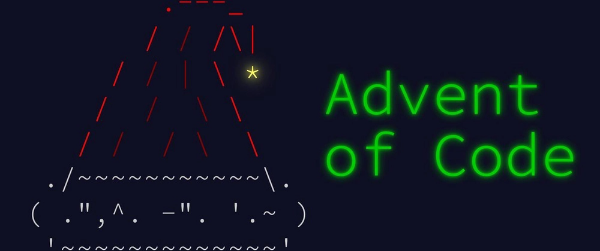

# Advent of Code 2025 🎄

    

This repository contains my solutions to [Advent of Code 2025](https://adventofcode.com/2025/) using Python3.

[Advent of Code](https://adventofcode.com/) made by [Eric Wastl](http://was.tl/) is a programming challenge start from 1st December to 25th December every year since 2015. Each day has two puzzles that you can solve with your programming language of choice.

AoC 2025 problems list:
- [Day 1: Secret Entrance](https://adventofcode.com/2025/day/1)
- [Day 2: Gift Shop](https://adventofcode.com/2025/day/2)
- [Day 3: Lobby](https://adventofcode.com/2025/day/3)
- [Day 4: Printing Department](https://adventofcode.com/2025/day/4)
- [Day 5: Cafeteria](https://adventofcode.com/2025/day/5)
- [Day 6: Trash Compactor](https://adventofcode.com/2025/day/6)
- [Day 7: Laboratories](https://adventofcode.com/2025/day/7)
